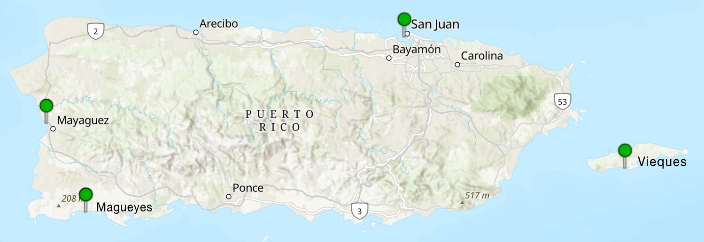

# Sea-Level-Rise_PR

## Visualizing Sea Level Rise Across Puerto Rico (2015–2025)

### Project Descrption: 
This project will use NOAA’s Tides & Currents API to analyze sea level data from January 2015 to January 2025 at four coastal tide stations in Puerto Rico. The primary goals are to identify long-term trends in sea level rise, compare patterns across different coastal regions and visualize variabilities to distinguish short-term anomalies from long-term change. 

### Rationale Statement:
The motivation behind this project stems from witnessing firsthand the eroding sea shores and rising sea levels as well as the increased gentrification across the island. It was an expected gradual increase in both sea levels and foreign interference. However, after Hurricane Maria in September 2017, there was a sudden increase in siezing control of the remaining beaches. Since then there have been a number of protests against developers aiming to privatize beaches for rental propertiese and hotels. What has prevented most of them suceeding is the environmental protection for nesting sea turtles.  

### Workflow:
- pandas
  > To load, clean, and manipulate the NOAA sea level data from CSV files. To compute annual averages, differences in Mean Sea Level (MSL), and identify trends over time at each station.
- geopandas
  > To map the geographic locations of the tide stations across Puerto Rico. This will allow me to overlay sea level trends on spatial data and possibly connect trends to regional geography or urban development zones.
- plotly
  > For creating interactive time-series visualizations of sea level rise at each location. Its interactive capabilities make it easier to compare data across years and stations, highlight anomalies, and show regional disparities. 
- Seaborn
  > To create clean, statistical plots like line graphs, box plots, or regression plots to visualize correlations or year-over-year trends in sea level rise. It’s particularly useful for showing patterns and variability across the four stations with aesthetically pleasing visuals. 

### Further Uses:
The project would provide a foundation for future projects that aim to explore the socioeconomic impacts of sea level rise, including real estate development, land use changes, and the vulnerability of coastal communities. Future uses could also involve broadening the amount of time analyzed or geographically expanding to other regions. 

### Files List:
1. MAYAGUEZ_NOAA_MSL-MHW-MHHW.csv
    > Yearly Sea Level Rise Averages in Mayagüez (#9759394)
2. PARGUERA_NOAA_MSL-MHW-MHHW.csv
    > Yearly Sea Level Rise Averages in Magueyes Island (#9759110)
3. SJ_NOAA_MSL-MHW-MHHW.csv
    > Yearly Sea Level Rise Averages in San Juan (#9755371)
4. VIEQUES_NOAA_MSL-MHW-MHHW.csv
    > Yearly Sea Level Rise Averages in Vieques Island (#9752695)
5. PR-SeaLevel_NOAA.csv
    > Yearly Sea Level Rise Averages across Puerto Rico

